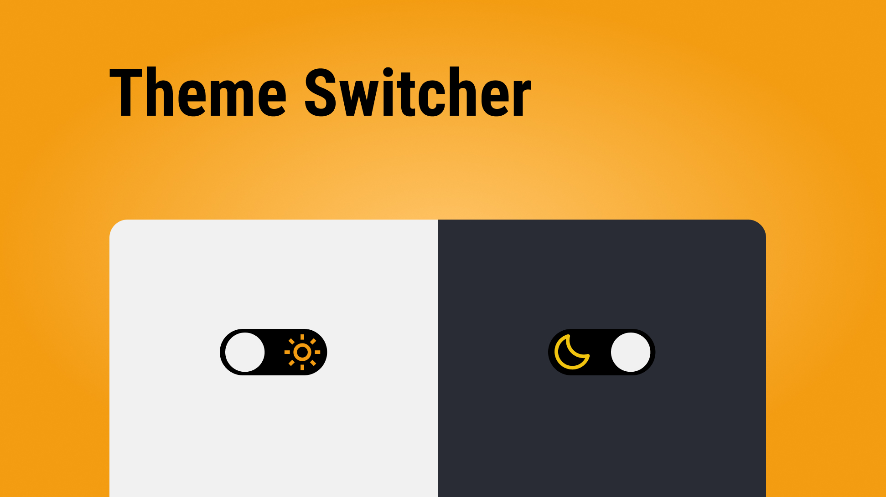

# Theme Switcher

## Technologies used

This project was done using the following technologies

 **Javascript**

 **HTML**

 **CSS**

## Objective of project

The objective of this project is to change the theme according to each person's taste. But in addition to an aesthetic preference, the practical use that many people tend to feel more comfortable with screens that have darker colors should also be mentioned, which may also be related to some visual difficulties. Such as having difficulty reading, or staying for a long time with a screen with very bright colors.

But with this simple button we can make our projects more beautiful and comfortable for everyone.

## What I learned from this project

In addition to always establishing previous knowledge, this project was very important to expand the following knowledge:

- DOM manipulation

- Conditionals

Even though it is something simple, it will definitely be something that I will use a lot in my next projects.
